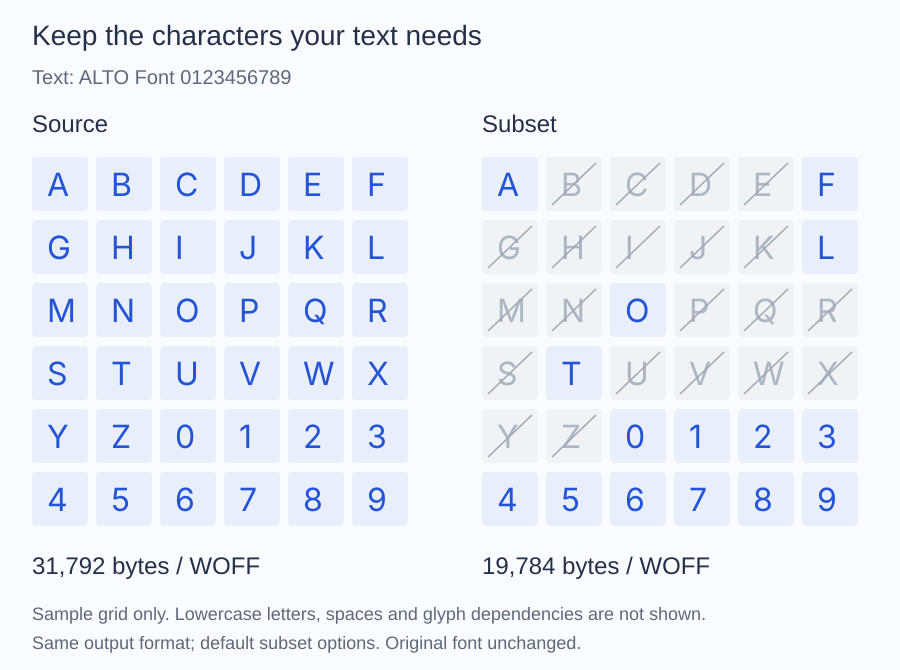

# Create a font subset

Keep the characters your application uses and write a new font file. This is
useful for fixed labels or a known translation corpus. For changing content,
include every required character or provide a fallback in your application.

## From text to a WOFF file

Install the package, place your font at `fonts/Inter-Regular.ttf`, and create
an `output` directory. Save this script beside `vendor` and run it with PHP.
The destination must not already exist.

```php
<?php

require __DIR__.'/vendor/autoload.php';

use Alto\Font\Font;
use Alto\Font\Subset\SubsetOptions;
use Alto\Font\Subset\UnicodeSet;
use Alto\Font\Writer\WoffWriter;

$font = Font::fromFile(__DIR__.'/fonts/Inter-Regular.ttf');
$characters = UnicodeSet::fromText('ALTO Font 0123456789');
$result = $font->subset(new SubsetOptions($characters));

$destination = __DIR__.'/output/inter-subset.woff';
new WoffWriter()->write($result->font, $destination);

printf("Saved inter-subset.woff (%d bytes)\n", filesize($destination));
printf("%d of %d requested characters found\n", $result->mappedCodepointCount, count($characters));
```

The result is a loadable WOFF file at `output/inter-subset.woff`. The script
prints its actual size and how many requested codepoints the source contains.
The original font stays unchanged. For WOFF2 output, use the
[WOFF2 writer with a Brotli compressor](convert/woff2.md).

The defaults preserve hinting and text layout data, including the glyphs needed
for supported substitutions and compound characters. Extra glyphs may therefore
remain. File-size savings depend on the source and selection; compare the
original and subset in the same output format when measuring subsetting alone.



For this Inter sample, writing the complete face as WOFF produces **31,792
bytes**, versus **19,784 bytes** for the default subset. The grid shows only
`A-Z` and `0-9`; lowercase letters, spaces and glyph dependencies are not shown.
These are measurements for one fixture, not promised savings for every font.
The measurements use the bundled Inter fixture.

## Check missing characters before writing

Characters absent from the source cannot be added by subsetting. They are not
reported as individual missing-character warnings. Add this check after
creating `$characters` and before calling `subset()` if every character is required:

```php
foreach ($characters as $codepoint) {
    if (null === $font->glyphIdForCodepoint($codepoint)) {
        throw new RuntimeException(sprintf('The font has no character U+%04X.', $codepoint));
    }
}
```

To allow missing characters, keep the original recipe and handle fallback in
the application using the font. For accented text, include the forms your
application uses: `é` and `e` followed by a combining accent are different
codepoint sequences. See [Unicode sets](subset/characters.md).

## Review the result

Continue the first script to inspect the retained glyph count and transformation
messages:

```php
printf("%d retained glyphs\n", $result->retainedGlyphCount);

foreach ($result->warnings as $warning) {
    fwrite(STDERR, $warning."\n");
}
```

Use `retainedGlyphCount` to understand how much glyph data remains, and
`filesize()` to measure the written WOFF file. Read each warning before
distributing the output. The [Subset API](#result-data)
describes every result field.

The default preserves original glyph numbers and leaves unused slots empty.
`$result->font->face()->glyphCount` includes these slots, so it is not the
retained glyph count.

## Adjust the selection or size

- [Build Unicode sets](subset/characters.md) from translations, codepoints, or CSS ranges.
- [Choose subset options](subset/options.md) to compact glyph numbers or remove hinting or layout data.
- [Check output size and rendering](subset/options.md#check-output-size-and-rendering) if a font is unsupported or its rendering changes.

Subsetting supports TrueType outlines. Variable fonts retain their axes; this
does not export a fixed weight. Test the generated font with your actual text
in the browser or application where it will be used.

## Subset guides

- [Characters](subset/characters.md) builds selections from text, codepoints, ranges, and CSS syntax.
- [Options](subset/options.md) controls glyph numbering, hinting, and text-layout data.
- [OpenType](subset/opentype.md) records the table-level preservation and rewriting boundaries.

## Result data

`Font::subset(SubsetOptions $options): SubsetResult` returns a new font and a
report. It does not modify or write the source file.

| Property | Meaning |
| --- | --- |
| `Font $font` | New font to inspect or pass to a writer. |
| `UnicodeSet $requestedUnicodes` | Normalized selection, including requested characters absent from the source. |
| `int $mappedCodepointCount` | Requested codepoints found in the source character map. |
| `int $originalGlyphCount` | Source glyph-slot count. |
| `int $retainedGlyphCount` | Retained glyphs, including required dependencies and the missing-glyph placeholder. |
| `int $sfntSize` | Size of the resulting uncompressed SFNT data in bytes. |
| `list<string> $warnings` | Transformation and preservation messages, not a list of missing characters. |

Preserve mode leaves unused glyph slots empty. Consequently,
`$result->font->face()->glyphCount` can exceed `retainedGlyphCount`. Use the
written file's size to measure WOFF or WOFF2 output.

## Failures and side effects

Subsetting may retain glyphs needed by compound outlines or supported
substitutions beyond the requested character mappings.

`UnsupportedFontException` reports unsupported outlines, selected variable
views, or structures that cannot be safely preserved or rewritten.
`InvalidFontException` reports malformed or inconsistent data and invalid
layout offsets. Both implement `FontExceptionInterface`.

Supported variable fonts retain their axes. Subsetting does not export a static
instance or restrict axis ranges. Use the original source, or call
`withoutVariations()` before subsetting a selected view.
